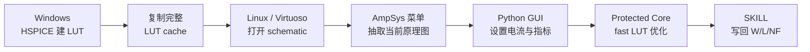

<div align="center">

# AmpSys Cadence Plugin

**从 Cadence Virtuoso schematic 一键进入 AmpSys 自动尺寸优化流程**

[](#平台支持)
[](#发布包结构)
[](#cadence-内使用)
[](https://github.com/KonataLin/AmpSysCadencePlugin/issues)

<p>
  <a href="Usage.md"><b>中文使用指南</b></a>
  &nbsp;|&nbsp;
  <a href="https://github.com/KonataLin/AmpSysCadencePlugin/releases"><b>下载 Release</b></a>
  &nbsp;|&nbsp;
  <a href="https://github.com/KonataLin/AmpSysCadencePlugin/issues"><b>提交 Issue</b></a>
  &nbsp;|&nbsp;
  <a href="https://www.afdian.com/a/LocyDragon"><b>赞助支持</b></a>
</p>

</div>

---

AmpSys Cadence Plugin 把 Cadence Virtuoso、Python GUI 和 AmpSys 优化核心串成一个完整流程：



## 它解决什么

| 痛点 | 插件做法 |
| --- | --- |
| 手动改 MOS 尺寸、反复试参数很慢 | 从 schematic 抽取器件，优化后自动生成写回结果 |
| Windows 有 HSPICE，Linux 才有 Virtuoso | Windows 建 LUT，Linux/Virtuoso 只使用 cache，不再跑 HSPICE |
| Cadence、Python、优化核心之间难排错 | 每个环节都写 `.log`、`telemetry.jsonl`、`result.json` |
| AmpSys 算法不能开源 | GUI/SKILL/wrapper 开源，核心算法以受保护二进制发布 |

## 平台支持

| 平台 | 状态 | 用途 |
| --- | --- | --- |
| Windows x86_64 | 支持 | GUI、HSPICE LUT 建表、环境检查 |
| Linux x86_64, glibc >= 2.17 | 支持 | Virtuoso 集成、cache-only 优化、SKILL 写回 |
| macOS / ARM / Alpine musl / 32-bit | 暂不支持 | 当前没有对应 protected core |

## 快速开始

完整流程请看：

[Usage.md](Usage.md)

Windows 安装：

```powershell
powershell -ExecutionPolicy Bypass -File <plugin-root>\install_windows.ps1 `
  -PluginRoot <plugin-root> `
  -EngineRoot <plugin-root>

py -3 <plugin-root>\tools\check_environment.py
```

Linux / Virtuoso 安装：

```bash
bash <plugin-root>/install_linux.sh \
  <plugin-root> \
  <plugin-root> \
  ~/.cdsinit

source ~/.bashrc
py -3 <plugin-root>/tools/check_environment.py
```

环境检查应至少看到：

```text
"status": "ok"
"tkinter": "ok"
```

## Cadence 内使用

1. Windows 侧用 HSPICE 建好 LUT cache。
2. 把完整 cache 目录复制到 Linux。
3. 从已加载 AmpSys 环境变量的 shell 启动 `virtuoso`。
4. 打开真正包含待优化器件的 schematic。
5. 点击 `AmpSys -> Extract Current Schematic...`。
6. 在 GUI 里确认 `LUT Cache = OK`，填写 MOS 电流和目标指标。
7. 点击 `Run Optimization`。
8. 完成后点击 `Confirm and Apply in Cadence` 写回尺寸。

## 发布包结构

```text
cli/                    Python GUI 与公开 runner wrapper
skill/                  Cadence SKILL 菜单、抽取和写回
tools/                  环境检查与 GUI launcher
core/                   Windows/Linux protected AmpSys core
install_windows.ps1     Windows 安装脚本
install_linux.sh        Linux/Virtuoso 安装脚本
Usage.md                完整中文使用指南
release_manifest.json   release 元数据
```

Windows core：

```text
core/windows_amd64/ampsys_core/ampsys_core.exe
```

Linux core：

```text
core/linux_x86_64.tar.gz
```

不要发布内部源码目录，例如 `AmpSys/`、`yami/`、`TheScanner/`、`acsolver/`。用户侧发布的是 GUI、SKILL、wrapper、安装脚本和受保护 core。

## 日志与反馈

遇到问题时，请优先附上相关日志：

```text
ampsys_skill.log
ampsys_launch.log
ampsys_gui.log
ampsys_optimize.log
telemetry.jsonl
result.json
ampsys_result.il
```

反馈入口：

[GitHub Issues](https://github.com/KonataLin/AmpSysCadencePlugin/issues)

赞助支持：

[爱发电 LocyDragon](https://www.afdian.com/a/LocyDragon)
