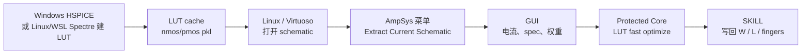

<div align="center">

# AmpSys Cadence Plugin

**从 Cadence Virtuoso schematic 到 AmpSys 自动尺寸优化的一体化插件**

[](http://ampsys.aiclab.top)
[](https://github.com/KonataLin/AmpSysCadencePlugin/releases)
[](https://github.com/KonataLin/AmpSysCadencePlugin/releases/tag/v0.1.0-alpha.3)
[](#平台支持)
[](https://github.com/KonataLin/AmpSysCadencePlugin/issues)

<p>
  <a href="http://ampsys.aiclab.top"><b>官方网站</b></a>
  &nbsp;·&nbsp;
  <a href="Usage.md"><b>使用指南</b></a>
  &nbsp;·&nbsp;
  <a href="https://github.com/KonataLin/AmpSysCadencePlugin/releases"><b>下载 Release</b></a>
  &nbsp;·&nbsp;
  <a href="https://github.com/KonataLin/AmpSysCadencePlugin/issues/new/choose"><b>反馈问题</b></a>
  &nbsp;·&nbsp;
  <a href="https://www.afdian.com/a/LocyDragon"><b>赞助支持</b></a>
</p>

</div>

---

> [!IMPORTANT]
> **重要声明 / Safety Notice**
>
> AmpSys Cadence Plugin 只用于模拟电路**初版设计辅助、尺寸探索和流程验证**，不能替代设计者的完整仿真、版图验证、PVT/Monte Carlo/可靠性检查和流片前 sign-off。
>
> 本插件不包含任何工艺库文件、PDK、model 文件或商业仿真器，也不提供 HSPICE、Cadence、Spectre、Calibre 等第三方软件授权。用户必须自行合法配置工艺库、仿真器和 EDA 环境。
>
> 本插件始终以公益免费方式提供。因使用、本地修改、二次分发或误用本插件造成的设计错误、项目延期、流片失败、经济损失或其它后果，作者概不负责。

AmpSys Cadence Plugin 把 **Virtuoso schematic 抽取**、**Python GUI 配置**、**AmpSys protected core 优化**、**SKILL 尺寸写回** 串成一个可重复的闭环。典型工作流是：用 Windows/HSPICE 或 Linux/WSL Spectre 建 LUT，Linux/Virtuoso 侧使用 fast LUT 优化并写回器件尺寸。



## 当前状态

| 项目 | 状态 |
| --- | --- |
| 最新测试版 | `v0.1.0-alpha.3` |
| 已实测 PDK | SMIC18MMRF / SMIC 180nm RF |
| 已实测链路 | Linux Virtuoso 抽取、GUI 优化、CDF 写回 |
| Windows 用途 | GUI、HSPICE LUT 建表、环境检查 |
| Linux 用途 | Virtuoso 集成、fast LUT 优化、Spectre 建 LUT、SKILL 写回 |

## 亮点

| 能力 | 说明 |
| --- | --- |
| 从 schematic 进入优化 | 在 Virtuoso 菜单中抽取当前打开的 schematic，无需手写 netlist |
| HSPICE/Spectre 建表 | 支持 Windows HSPICE 建 LUT，也支持 Linux/WSL Cadence Spectre 建 LUT |
| 可视化 GUI | LUT、器件电流、spec、权重、收敛过程和结果在一个流程页里完成 |
| Spectre AutoSearch / APS | PDK model 由用户手动选择；Spectre 可执行文件可一键搜索；默认 `++aps` 加速，失败自动回退普通 Spectre |
| CDF 写回 | 支持 `W / L / fingers / m` 等常见 CDF 参数别名，SMIC18MMRF 已验证 `Total Width + Finger Width` 写回 |
| 详细日志 | GUI、SKILL、runner、optimization、telemetry 都会落盘，方便定位环境问题 |
| 核心保护 | GUI/SKILL/wrapper 公开，AmpSys 内部算法以 protected binary 发布 |

## 平台支持

| 平台 | 状态 | 用途 |
| --- | --- | --- |
| Windows x86_64 | 支持 | standalone GUI、HSPICE LUT 建表、环境检查 |
| Linux x86_64, glibc >= 2.17 | 支持 | Virtuoso 菜单、standalone GUI、Spectre LUT 建表、fast LUT 优化、SKILL 写回 |
| macOS / ARM / Alpine musl / 32-bit | 暂不支持 | 当前没有对应 protected core |

## 获取方式

普通用户请下载 GitHub Release 里的完整 zip：

[下载最新 Release](https://github.com/KonataLin/AmpSysCadencePlugin/releases/latest)

Release 包应包含：

```text
cli/                    GUI 脚本与公开 runner wrapper
gui/                    Windows/Linux standalone GUI
skill/                  Virtuoso 菜单、schematic 抽取、结果写回
tools/                  环境检查与 GUI launcher
core/                   Windows/Linux protected AmpSys core
install_windows.ps1     Windows 安装脚本
install_linux.sh        Linux/Virtuoso 安装脚本
Usage.md                中文使用指南
README.md               项目主页
```

> 直接 `git clone` 得到的是公开 wrapper 和工程文件，不包含可发布的 protected core。最终用户请优先使用 Release zip。

## 快速开始

Windows 安装：

```powershell
powershell -ExecutionPolicy Bypass -File <plugin-root>\install_windows.ps1 `
  -PluginRoot <plugin-root> `
  -EngineRoot <plugin-root>

py -3 <plugin-root>\tools\check_environment.py
```

Linux / Virtuoso 安装：

```bash
bash <plugin-root>/install_linux.sh \
  <plugin-root> \
  <plugin-root> \
  ~/.cdsinit

source ~/.bashrc
py -3 <plugin-root>/tools/check_environment.py
```

完整流程请看：[Usage.md](Usage.md)

## 推荐工作流

1. 在 GUI 中手动选择 PDK 的 HSPICE/Spectre `.lib/.scs` model 文件，并填写 NMOS/PMOS 名称、工艺角、温度和 cache 目录。
2. 用 Windows/HSPICE 或 Linux/WSL Spectre 点击 `Build Library` 生成 LUT cache。
3. 将完整 cache 目录复制到 Linux。
4. 在 Linux/Virtuoso 中打开待优化 schematic。
5. 点击 `AmpSys -> Extract Current Schematic...`。
6. 在 GUI 里确认 LUT、器件、电流、spec 和权重。
7. 点击 `Run Optimization`。
8. 结果完成后点击 `Confirm and Apply in Cadence` 写回 CDF 参数。

## 日志与诊断

如果遇到问题，请在 Issue 中附上相关日志：

```text
ampsys_skill.log
ampsys_launch.log
ampsys_gui.log
ampsys_optimize.log
telemetry.jsonl
result.json
ampsys_result.il
```

常用入口：

```text
Windows GUI: gui/windows_amd64/ampsys_gui/ampsys_gui.exe
Linux GUI:   gui/linux_x86_64/ampsys_gui/ampsys_gui
Env check:   tools/check_environment.py
```

## 反馈与支持

- 官方网站：[ampsys.aiclab.top](http://ampsys.aiclab.top)
- Bug / 兼容性问题：[GitHub Issues](https://github.com/KonataLin/AmpSysCadencePlugin/issues/new/choose)
- Release 下载：[GitHub Releases](https://github.com/KonataLin/AmpSysCadencePlugin/releases)
- 赞助支持：[爱发电 LocyDragon](https://www.afdian.com/a/LocyDragon)
