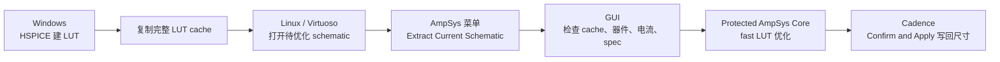

# AmpSys Cadence Plugin 使用指南

这份文档面向第一次安装和第一次跑通的用户。推荐工作流是：



当前 release 的设计目标是：GUI、SKILL、安装脚本和 wrapper 可以公开；AmpSys 内部算法以 Windows/Linux 受保护二进制核心发布，不公开 `AmpSys`、`yami`、`TheScanner`、`acsolver` 源码。

Release 包自带 Windows/Linux standalone GUI 和 protected core。普通用户不需要安装 NumPy、SciPy、Numba、Cython 等 AmpSys 内部依赖。系统 Python 只用于环境检查、脚本调试和 fallback；Cadence 主流程会优先调用 standalone GUI。

## 1. 支持环境

| 环境 | 用途 | 状态 |
| --- | --- | --- |
| Windows x86_64 | GUI、HSPICE 建 LUT cache、环境检查 | 支持 |
| Linux x86_64, glibc >= 2.17 | Virtuoso 集成、cache-only 优化、SKILL 写回 | 支持 |
| macOS / ARM / Alpine musl / 32-bit | 当前 release 没有对应 core | 不支持 |

正常情况下整包复制即可，不要拆目录。安装时通常让：

```text
PluginRoot = release 包根目录
EngineRoot = release 包根目录
```

## 2. 发布包应该包含什么

完整 release 包根目录应包含：

```text
cli/                    GUI 与公开 runner wrapper
gui/                    Windows/Linux standalone GUI
skill/                  Cadence 菜单、schematic 抽取、结果写回
tools/                  环境检查与 GUI launcher
core/                   Windows/Linux 受保护 AmpSys core
install_windows.ps1     Windows 安装脚本
install_linux.sh        Linux/Virtuoso 安装脚本
Usage.md                本文档
README.md               项目主页说明
release_manifest.json   release 元数据
```

Windows core 应存在：

```text
core/windows_amd64/ampsys_core/ampsys_core.exe
```

Linux release 包中应存在：

```text
core/linux_x86_64.tar.gz
```

Linux 安装脚本会自动解压出：

```text
core/linux_x86_64/ampsys_core/ampsys_core
```

standalone GUI 应存在：

```text
gui/windows_amd64/ampsys_gui/ampsys_gui.exe
gui/linux_x86_64/ampsys_gui/ampsys_gui
```

如果从 GitHub `git clone` 获取，请先安装 Git LFS，并确认 core 文件不是很小的 LFS pointer。更推荐直接下载 GitHub Release 里的完整压缩包。

## 3. Windows 安装

在 PowerShell 里执行：

```powershell
powershell -ExecutionPolicy Bypass -File <plugin-root>\install_windows.ps1 `
  -PluginRoot <plugin-root> `
  -EngineRoot <plugin-root>
```

检查环境：

```powershell
py -3 <plugin-root>\tools\check_environment.py
```

如果用户机器没有 Python，仍可直接打开 standalone GUI：

```powershell
<plugin-root>\gui\windows_amd64\ampsys_gui\ampsys_gui.exe
```

看到下面字段即可：

```text
"status": "ok"
"tkinter": "ok"
```

手动打开 GUI：

```powershell
<plugin-root>\gui\windows_amd64\ampsys_gui\ampsys_gui.exe
```

开发/调试时也可以使用公开脚本入口：

```powershell
py -3 <plugin-root>\cli\ampsys_gui.py
```

Windows 侧主要用来建 LUT cache。真正从 Virtuoso schematic 抽取并优化，推荐在 Linux/Cadence 环境里做。

## 4. Windows 建 LUT Cache

打开 GUI 后，Windows 会显示 `Windows LUT Builder` 模式。

需要填写：

| 字段 | 含义 |
| --- | --- |
| Cache dir | LUT 保存目录 |
| Model path | HSPICE model 文件路径 |
| HSPICE dir | HSPICE 可执行文件所在目录 |
| NMOS name | NMOS model/cell 名称，可用逗号分隔多个别名 |
| PMOS name | PMOS model/cell 名称，可用逗号分隔多个别名 |
| Corner/lib | 工艺角或 `.lib` section，例如 `tt` |
| Temp C | 建表温度 |
| VDD V | 工艺电源电压 |

点 `Build Library` 开始建表。建好以后，cache 目录里通常应包含：

```text
nmos_*.pkl
pmos_*.pkl
nmos_*_data/
pmos_*_data/
```

如果你已经有可用 LUT，不需要重新建表，直接在 GUI 里选择已有 `Cache dir`。只要 `LUT Cache` 变成 OK，就可以继续。

## 5. 把 Cache 从 Windows 带到 Linux

复制整个 cache 目录，不要只复制 `.pkl` 文件。推荐在 Linux 上放到类似：

```text
~/ampsys_lut/<process>_<corner>
```

注意：Linux GUI 里要选择 Linux 本机路径，不能继续使用 `D:\...` 或 `H:\...` 这种 Windows 路径。

Linux/Virtuoso 侧只消耗 LUT cache，不需要 HSPICE，也不需要 model path。优化路径默认走 fast LUT，不做 cosim。

## 6. Linux / Virtuoso 安装

用真正启动 Virtuoso 的那个 Linux 用户执行安装脚本：

```bash
bash <plugin-root>/install_linux.sh \
  <plugin-root> \
  <plugin-root> \
  ~/.cdsinit
```

刷新当前 shell：

```bash
source ~/.bashrc
```

检查环境：

```bash
py -3 <plugin-root>/tools/check_environment.py
```

如果 Linux 用户没有可用 Python，Cadence 主流程仍会优先调用 standalone GUI：

```bash
<plugin-root>/gui/linux_x86_64/ampsys_gui/ampsys_gui
```

看到下面字段即可：

```text
"status": "ok"
"tkinter": "ok"
```

然后从同一个 shell 启动 Virtuoso：

```bash
virtuoso &
```

如果某个项目目录自带 `.cdsinit`，Cadence 可能优先加载项目目录的 `.cdsinit`，导致 `~/.cdsinit` 里的 AmpSys 没生效。此时把下面这一行加入项目 `.cdsinit`：

```skill
load(strcat(getShellEnvVar("AMPSYS_PLUGIN_ROOT") "/skill/ampsys_init.il"))
```

或者重新运行安装脚本，把第三个参数指向项目 `.cdsinit`。

## 7. 在 Cadence 里跑一次

1. 打开真正包含 MOS、R、C 器件的待优化 schematic。
2. 确认电源和关键信号 net 已经按约定命名。
3. 点击 `AmpSys -> Extract Current Schematic...`。
4. 插件会导出当前 schematic 的 netlist，并自动打开 AmpSys GUI。
5. 在 GUI 顶部确认 `LUT Cache` 为 OK。
6. 在 Devices 区域确认 MOS 都被识别出来。
7. 给每个 MOS 填 `Id uA`。
8. 设置常用 spec，例如 gain、GBW、phase margin、load cap。
9. 点击 `Run Optimization`。
10. 结果出来后点击 `Confirm and Apply in Cadence`。

如果 GUI 是从 Cadence 打开的，点击确认后 SKILL timer 会自动写回。若没有自动写回，可以在 Virtuoso 里手动点：

```text
AmpSys -> Apply Last Result
```

## 8. 命名约定

当前 GUI 会检查这些常用全局 net：

```text
VDD
GND
Vin
Vout
```

`Vb_*`、`Vb_inp`、`Vb_inn` 是可选 bias/结构相关命名，不是所有电路都必须有。不要为了通过检查硬加无意义的 bias net。

`V_in_cm` 和 `V_out_cm` 是 GUI 里的可选初猜/配置字段，不是必须在 schematic 里出现的端口名。

差分或特殊拓扑时，优先保持 schematic net 名和 AmpSys 目标拓扑一致；如果 GUI 识别结果明显不对，先看 Devices 表和 Settings 里的 Terminal Order Preview。

## 9. 器件识别与 Terminal Order

默认情况下，SKILL 会优先读取器件 CDF/simInfo 里的 `termOrder`。如果没有 `termOrder`，会回退到 master terminals。

正常 MOS 端口顺序默认是：

```text
D G S B
```

如果某个 PDK 的 NMOS/PMOS 端口顺序不同，在 GUI 的 `Settings` 展开区修改：

```text
NMOS terminal order
PMOS terminal order
```

每个 terminal order 必须且只能包含一次：

```text
D G S B
```

写回尺寸时默认支持常见 CDF 参数别名，例如：

```text
Width aliases:   w, W, wr, width
Length aliases:  l, L, lr, length
Finger aliases:  nf, nfin, nFin, fingers, finger, ng
Multiplier aliases: m
Passive value aliases: c, C, r, R, value
```

大多数 PDK 不需要改 Settings。只有器件识别、端口映射或写回参数名异常时再改。

## 10. GUI 里哪些字段最常用

常用字段集中在主流程页：

| 区域 | 必填/常用 | 说明 |
| --- | --- | --- |
| LUT Cache | Cache dir、NMOS name、PMOS name、Corner/lib、Temp C、VDD V | Linux 只需要这些，不需要 HSPICE/model path |
| Devices | 每个 MOS 的 `Id uA` | 没填全会阻止 Run 并提示 |
| Specs | Gain min、GBW、PM min、Load cap | 目标指标 |
| Run | Population、Generations | 优化规模 |
| Results | Confirm and Apply in Cadence | 写回 Cadence |

可选字段：

```text
V in cm
V out cm
Saturation margin
Settings 里的 terminal order 和参数别名
```

这些不是每个设计都必须改。

## 11. 日志在哪里

所有关键环节都会写日志，避免静默失败。

从 Cadence 打开 GUI 后，项目运行目录通常在：

```text
<plugin-root>/workspace/<lib>_<cell>/
```

常用日志和结果文件：

```text
ampsys_skill.log          SKILL 抽取、启动、写回日志
ampsys_launch.log         Cadence 启动 Python GUI 的命令日志
ampsys_gui.log            GUI 启动、字段、异常日志
ampsys_optimize.log       AmpSys runner 优化日志
telemetry.jsonl           迭代过程数据
result.json               优化结果
ampsys_result.il          Cadence 写回脚本
apply.request             GUI 请求 Cadence 写回的标志文件
```

如果是手动打开 GUI，日志会在当前 project JSON 所在目录。

## 12. 常见问题

### GUI 打开了，但 LUT Cache 不是 OK

检查：

1. `Cache dir` 是否是 Linux/Windows 当前系统真实存在的路径。
2. 目录里是否有 `nmos_*.pkl`、`pmos_*.pkl` 和对应 `_data/` 目录。
3. `NMOS name`、`PMOS name`、`Corner/lib`、`Temp C` 是否和建表时一致。
4. 如果是从 Windows 复制到 Linux，确认复制的是完整目录，不是只复制两个 pkl。

### Cadence 里没有 AmpSys 菜单

检查：

```bash
echo $AMPSYS_PLUGIN_ROOT
echo $AMPSYS_ENGINE_ROOT
```

再确认当前 Virtuoso 加载的 `.cdsinit` 里有：

```skill
load(strcat(getShellEnvVar("AMPSYS_PLUGIN_ROOT") "/skill/ampsys_init.il"))
```

如果项目目录有自己的 `.cdsinit`，要把这一行也加进去。

### 点击 Apply Last Result 但提示找不到结果

这是正常保护逻辑。必须先完成一次优化，让运行目录里生成：

```text
result.json
ampsys_result.il
```

然后再 apply。

### 识别到的 MOS 数量不对

优先看：

```text
ampsys_skill.log
ampsys_gui.log
Settings -> Terminal Order Preview
```

常见原因是打开了 testbench 或顶层 wrapper，而不是实际包含 MOS 的 schematic；或者 PDK 器件 model 名没有加入 `NMOS name` / `PMOS name`。

### 写回后 W/L/NF 没变化

检查：

1. instance 名是否和优化结果里的名字一致。
2. PDK CDF 参数是否使用非常规名字。
3. 在 Settings 里补充 Width/Length/Finger aliases。
4. 看 `ampsys_skill.log` 里是否有 `Write CDF param` 或 warning。

## 13. 推荐第一次测试流程

先不要直接上复杂工程。推荐这样试：

1. 在 Windows 用已知 example 或已确认 model 建出 LUT cache。
2. 把完整 cache 复制到 Linux。
3. 在 Linux 跑：

```bash
py -3 <plugin-root>/tools/check_environment.py
```

4. 从同一个 shell 启动 Virtuoso。
5. 打开一个小规模 OTA schematic。
6. 点 `AmpSys -> Extract Current Schematic...`。
7. 确认 GUI 中：

```text
LUT Cache = OK
Devices 数量正确
每个 MOS 的 Id uA 已填写
Run Optimization 可点击
```

8. 跑少量 generation 先确认链路。
9. 写回后检查 schematic 里的 W/L/NF。
10. 最后再提高 population/generation 做正式优化。

## 14. 反馈与支持

项目主页：

[https://github.com/KonataLin/AmpSysCadencePlugin](https://github.com/KonataLin/AmpSysCadencePlugin)

提交问题：

[https://github.com/KonataLin/AmpSysCadencePlugin/issues](https://github.com/KonataLin/AmpSysCadencePlugin/issues)

赞助支持：

[https://www.afdian.com/a/LocyDragon](https://www.afdian.com/a/LocyDragon)

## 13. 本版 GUI 行为说明

- `Run Optimization` 默认保持 quiet 模式，不打开 verbose；进度条和动态指标图来自 `telemetry.jsonl`，不会因为 verbose 关闭而停止刷新。
- GUI 和日志中不显示原始 fitness 数值，对外统一显示为 Convergence/收敛度；`telemetry.jsonl` 和 `result.json` 也不会写出 raw fitness。
- 动态 metric 图按实际结果显示指标：单端电路没有 CMRR/PSRR 时不会硬显示；差分电路若引擎返回 CMRR、PSRR、Area，则会自动加入动态指标图和结果摘要。
- W/L 写回默认保留小数点后 2 位，例如 `1.93u`；需要修改时展开 GUI 底部 `Settings`，改 `Geometry decimals`，合法范围是 0 到 9。

## 15. Run 前快速诊断

如果已经从 Cadence 导出了 schematic，但不确定 cache、器件电流、V2 engine 或写回路径是否正确，先运行：

```bash
py -3 <plugin-root>/cli/ampsys_runner.py diagnose --project <workspace>/<lib_cell>/project.json
```

在 Linux/Virtuoso 环境中也可以使用安装脚本创建的绝对 Python shim：

```bash
/home/<user>/bin/py -3 /opt/AmpSysCadencePlugin/cli/ampsys_runner.py diagnose --project /opt/AmpSysCadencePlugin/workspace/<lib_cell>/project.json
```

看到下面这些字段即可继续点 `Run Optimization`：

```text
"status": "ok"
"issues": []
"v2_source_engine": true
"runner_would_delegate_optimize": false
"library": { "ready": true, ... }
"devices": { "missing_current": [] }
```

`diagnose` 不会跑优化、不建 LUT、不调用 HSPICE，只做 project/cache/engine/writeback 路径检查。若 `issues` 非空，先按提示修复后再运行优化。
